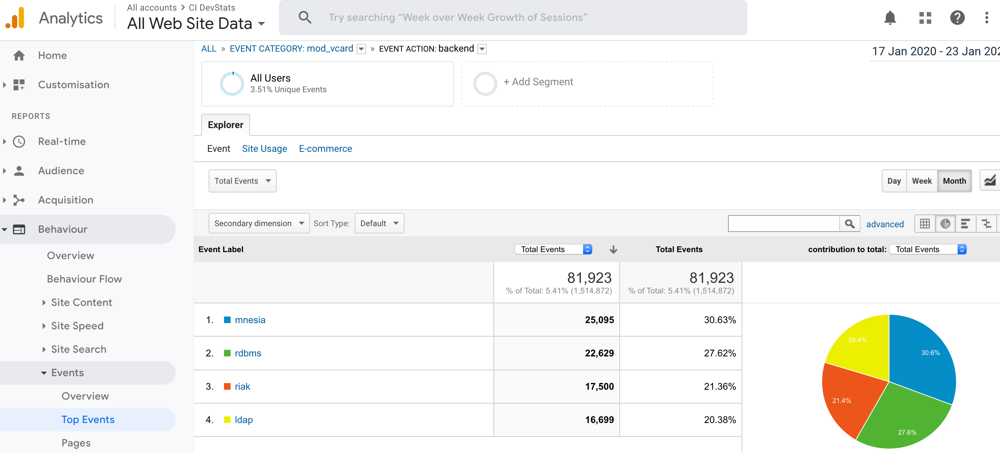

# Introduction
MongooseIM system metrics are gathered to analyse the trends and needs of our users, improve MongooseIM, and know where to focus our efforts.
This section is devoted to explaining on how to customise, read, enable and disable collecting of the system metrics.

# Consent
To ensure the transparency of the functionality being enabled, a log message is generated on every MongooseIM node start (unless metrics service is configured with `report` option). User is being notified that the metrics are gathered and has the right to withdraw the consent at any time without limiting functionalities of the product. For more information on how to disable this feature, please see the [Services](Services.md#service_mongoose_system_metrics) section.

# What information is being gathered?
While developing this feature it is crucial for us to be fully transparent as to what information is being gathered. In general we capture information on how MongooseIM is being used, its version and with what feature set. We only report the names of known modules and APIs that are part of opensource and count customisations without disclosing any details. User can view all the information that is shared in two different ways. Log file `???LOG FILE NAME FROM JIRA TASK???` contains the most recent report that was sent. Moreover, user can configure Tracking ID for their own Google Analytics account and have a view on their MongooseIM status in that dashboard. For more information on how to setup the Tracking ID, please see [How to configure additional and private Tracking ID in Google Analytics.](#How-to-configure-additional-and-private-Tracking-ID-in-Google-Analytics).

Full list of information that is being gathered can be seen below:
* MongooseIM node uptime.
* MongooseIM version.
* Number of nodes that are part of the MongooseIM cluster
* Generic modules that are part of the opensource project and are in use. Some modules report what database they use as a backend.
* Number of custom modules - without disclosing any details, we are just curious to see if there are any.
* Number of connected external XMPP components.
* List of configured REST APIs that are part of the opensource project.
* XMPP transport mechanisms.
* Geographical Data - Google Analytics is providing a number of geographical dimensions, such as City, Country, Continent. These values are derived from the IP address, the data was sent from. See [About Geographical Data](https://support.google.com/analytics/answer/6160484?hl=en) for more details.

# How the information is being used?

Information collected is automatically anonymised before it is being processed further. Each MongooseIM is generating random Client ID that is being attached to the reports. The data collected has only statistical relevance and aims to help us understand the needs of our users. Knowing how our product is used will point us into the direction on how should we focus further efforts while developing the product.

# How a report looks like?
Sample report showing metrics for the mod_vcard backends from the Google Analytics can be found below.

Based on such report we can see the frequency of different backends being used with mod_vcard.

# How often the metrics are reported?

Metrics are reported first on the system startup and later at regular intervals. These timers are configuration parameters `initial_report` and `periodic_report`. The default values are 5 minutes for the initial report and 3 hours for the periodic one. These reporting intervals can be changed depending on the configuration parameters. Please see [Services](Services.md#service_mongoose_system_metrics) section for more details.

# How to configure this service?
This functionality is provided as a "service".
For more details regarding service configuration, please see [Services](Services.md) section.

# [WIP] How to configure additional and private Tracking ID in Google Analytics

The data that is gathered

# [WIP] Data Sharing Policy
We will not share any information with furhter third parties

