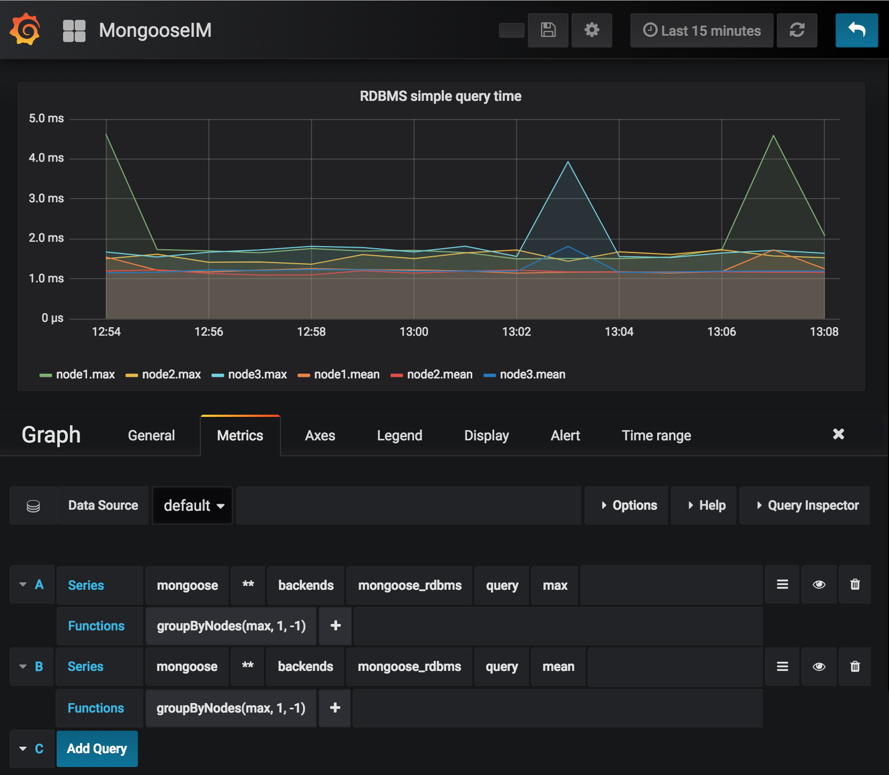

## Logs

We strongly recommend storing logs in one centralized place when working in a clustered environment.
MongooseIM uses the standard OTP logging framework: [Logger][Logger].
Its handlers can be replaced and customised, according to Logger's documentation.

### Syslog integration

MongooseIM uses `syslogger` as a Logger handler for syslog.
To activate it you have to add `syslogger` to the applications section in `src/mongooseim/app.src`:

    %% syslogger, % uncomment to enable a logger handler for syslog

You also need to edit `rel/files/app.config` and uncomment the lines:

     % Uncomment these lines to enable logging to syslog.
     % Remember to add syslogger as a dependency in mongooseim.app.src.
    %% {syslogger, [
    %%     {ident, "mongooseim"},
    %%     {logger, [
    %%         {handler, sys_log, syslogger,
    %%          #{formatter => {logger_formatter, #{single_line => true}}}}]}]
    %% },

You can provide different parameters to change the handler's behaviour as described
in the `syslogger's` [GitHub page](https://github.com/NelsonVides/syslogger/):

* `ident` - a string to tag all the syslog messages with.
 The default is `mongooseim`.
* `facility` -  the facility to log to (see the syslog documentation).
* `log_opts` - see the syslog documentation for the description.

Depending on the system you use, remember to also add the appropriate line in the syslog config file.
For example, if the facility `local0` is set:

    local0.info                     /var/log/mongooseim.log

All the logs of level `info` should be passed to the `/var/log/mongooseim.log` file.

Example log (e.g `tail -f /var/log/mongooseim.log`):

    Apr  1 12:36:49 User.local mongooseim[6068]: [info] <0.7.0> Application mnesia started on node mongooseim@localhost

### Further / multiserver integration

For more advanced processing and analysis of logs, including gathering logs from multiple machines,
you can use one of the many available systems (e.g. logstash/elasticsearch/kibana, graylog, splunk),
by redirecting mongoose logs to such service with an appropriate [Logger][Logger]'s handler.

Check [Logging](Logging.md) for more information.

## Monitoring

### WombatOAM

WombatOAM is an operations and maintenance framework for Erlang based systems.
Its Web Dashboard displays this data in an aggregated manner.
Additionally, WombatOAM provides interfaces to feed the data to other OAM tools such as Graphite, Nagios or Zabbix.

For more information see: [WombatOAM](https://www.erlang-solutions.com/products/wombat-oam.html).

### graphite-collectd

To monitor MongooseIM during load testing, we recommend the following open source applications:

- [Grafana](https://grafana.com/) is used for data presentation.
- [Graphite](http://graphiteapp.org/) is a server used for metrics storage.
- [collectd](http://collectd.org/) is a daemon running on the monitored nodes capturing data related to CPU and Memory usage, IO etc.

### Plug-in Exometer reporters

MongooseIM uses [a fork of Exometer library](https://github.com/esl/exometer_core) for collecting metrics.
Exometer has many plug-in reporters that can send metrics to external services. We maintain [exometer_report_graphite](https://github.com/esl/exometer_report_graphite) and [exometer_report_statsd](https://github.com/esl/exometer_report_statsd) for Graphite and StatsD respectively.
It is possible to enable them in MongooseIM via the `app.config` file.
The file sits next to the `mongooseim.toml` file in the `rel/files` and `_REL_DIR_/etc` directories.

Below you can find a sample configuration.
It shows setting up a reporter connecting to graphite running on localhost.

You can see an additional option not listed in the Exometer docs - `mongooseim_report_interval`, which sets the metrics' resolution, i.e. how often Exometer gathers and sends metrics through reporters.
By default, the resolution is set to 60 seconds.

```erlang
...
{exometer_core, [
    {mongooseim_report_interval, 60000}, %% 60 seconds
    {report, [
        {reporters, [
                     {exometer_report_graphite, [
                                                 {prefix, "mongooseim"},
                                                 {connect_timeout, 5000},
                                                 {host, "127.0.0.1"},
                                                 {port, 2003},
                                                 {api_key, ""}
                                                ]}
                    ]}
    ]}
  ]}
...
```

### Run Graphite & Grafana in Docker - quick start

The following commands will download the latest version of `kamon/grafana_graphite` docker image that contains both Grafana and Graphite, and start them while mounting the local directory `./docker-grafana-graphite-master/data` for metric persistence:

```bash
curl -SL https://github.com/kamon-io/docker-grafana-graphite/archive/master.tar.gz | tar -xzf -
make -C docker-grafana-graphite-master up
```

Go to [http://localhost:80](http://localhost:80) to view the Grafana dashboard that's already set up to use metrics from Graphite.

### Add metrics to Grafana dashboard

We recommend the following metrics as a baseline for tracking your MongooseIM installation.
For time-based metrics, you can choose to display multiple calculated values for a reporting period - we recommend tracking at least `max`, `median` and `mean`.

```
Session count:                   <prefix>.global.totalSessionCount.value
XMPP messages received:          <prefix>.<domain>.xmppMessageReceived.one
XMPP messages sent:              <prefix>.<domain>.xmppMessageSent.one
Successful logins:               <prefix>.<domain>.sessionSuccessfulLogins.one
Logouts:                         <prefix>.<domain>.sessionLogouts.one
Authorization time:              <prefix>.<domain>.backends.auth.authorize.<value-type>
RDBMS "simple" query time:       <prefix>.<domain>.backends.mongoose_rdbms.query.<value-type>
RDBMS prepared query time:       <prefix>.<domain>.backends.mongoose_rdbms.execute.<value-type>
MAM lookups:                     <prefix>.<domain>.mam_lookup_messages.one
MAM archivization time:          <prefix>.<domain>.backends.mod_mam.archive.<value-type>
MAM lookup time:                 <prefix>.<domain>.backends.mod_mam.lookup.<value-type>
MAM private messages flush time: <prefix>.<domain>.mod_mam_rdbms_async_pool_writer.flush_time.<value-type>
MAM MUC messages flush time:     <prefix>.<domain>.mod_mam_muc_rdbms_async_pool_writer.flush_time.<value-type>
```

Note that RDBMS metrics are only relevant if MongooseIM is [configured with an RDBMS backend](../configuration/database-backends-configuration.md), MAM metrics when [mod_mam is enabled](../modules/mod_mam.md) and MAM flush times when MAM is configured with an RDBMS backend with `async_writer` option (default).

#### Example graph in Grafana



This screenshot shows a graph plotting the RDBMS simple query time metric mentioned above.
The graph is plotted for three nodes with each node having a different prefix: `mongoose.node1`, `mongoose.node2` and `mongoose.node3`.

The queries take metrics for all nodes and all domains (`**` is a wildcard for multiple parts of the metric name) and group them *per-node* and *per-value-type* (respectively `1`st and `-1`st part of the metric's name).
Parts of the names are indexed from `0`.

Time-based metrics in MongooseIM are given in **microseconds**, so to display human-readable values in graph's legend, the Y-axis unit has to be edited on the `Axes` tab.

[Logger]: https://erlang.org/doc/apps/kernel/logger_chapter.html#handlers
